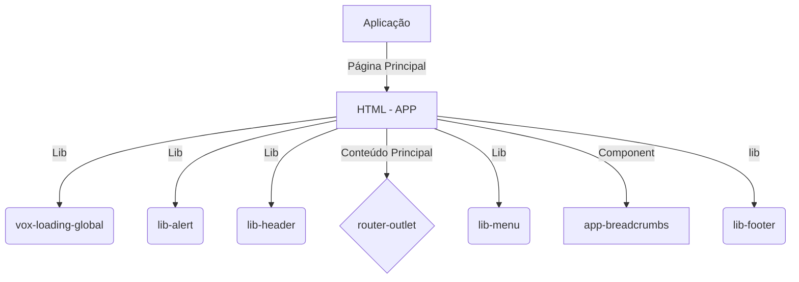
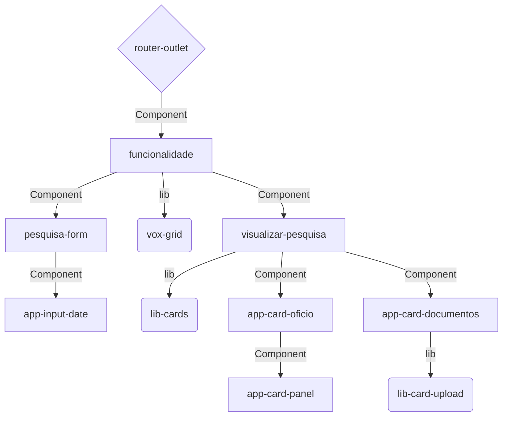

# Skeleton Projetos Interno Sigfacil Angular

Projeto gerado com [Angular CLI](https://github.com/angular/angular-cli) version 8.3.21.

## Pre-requisitos

- Node 12.13.0
- NPM 5.10.0

## Execução

* Start deste projeto deve executar `npm run start`

## Acessar ambiente local

* [Local host](http://localhost:4200)

## Sobre o projeto

O projeto tem finalidade de trazer uma pré configuração da estrutura dos principais componentes e serviços utilizados para montar o layout interno do SigFácil. Trazendo com ele [libs](https://gitlab.voxtecnologia.com.br/?sort=latest_activity_desc&utf8=%E2%9C%93&name=lib-&sort=latest_activity_desc) internas da Vox que darão a base do sistema.

#### As três principais libs que dão identidade visual do projeto são:
___

- **1** - [Lib-header](https://gitlab.voxtecnologia.com.br/vox/bibliotecas/front-end/lib-vox-header) 
- **2** - [Lib-menu](https://gitlab.voxtecnologia.com.br/vox/bibliotecas/front-end/lib-vox-menu)
- **3** - [Lib-footer](https://gitlab.voxtecnologia.com.br/vox/bibliotecas/front-end/lib-vox-menu)

> Abaixo um exemplo visual da disposição dessas libs

Essa é a tela base do projeto, na área do conteúdo principal será acrescentado as funcionalidades da nova aplicação.

#### Gráfico de estrutura base
___
Veja o gráfico da estrutura de libs e components presentes no projeto base

___
#### Serviços

Para popular os componentes foram criado alguns mocks, quando for substituir os links dos mocks por end-point da api, seguir o mesmo padrão de estrutura. Os mocks encontran-se no arquivo `src/app/services/user.service.ts`

Veja abaixo os endpoints nescessários:

[Lib-header](https://gitlab.voxtecnologia.com.br/vox/bibliotecas/front-end/lib-vox-header) 
*  Dados do sistema, função `getSystem()` [Exemplo de estrutura](https://www.mocky.io/v2/5b645c5b2e00008d00414025)
*  Dados do usuário logado, função `getUser()` [Exemplo de estrutura](https://www.mocky.io/v2/5b23f0fb2f00007d00e097c4)
*  Logo do sistema, função `getPathLogo()` [Exemplo de estrutura](https://www.mocky.io/v2/5c98e8913200007402d906ab)
*  Hora do sistema, função `getTime()` [Exemplo de estrutura](https://www.mocky.io/v2/5b63630630000052006503ef)

[Lib-menu](https://gitlab.voxtecnologia.com.br/vox/bibliotecas/front-end/lib-vox-menu)
*  Módulos do menu, função `getModulos()` [Exemplo de estrutura](https://www.mocky.io/v2/5e16301b34000070eb406a2c)

## Exemplo de implementação de uma funcionalidade
Foi implementado uma nova funcionalidade para ter um exemplo de uso de outras Libs da vox, a estrutura dela é essa: 

